# Sentinel — Project Review

Prepared for an outside technical reviewer ahead of a hackathon deadline. Every factual claim below was verified directly against the current repository (`git log`, `prisma/schema.prisma`, the actual route/lib source files) and the live production database during this pass — not carried over from memory of earlier discussion. Where something could not be independently re-verified, that's stated explicitly rather than assumed.

Verified: 2026-08-28. Repo state: 40 commits, `2823e9d`→`04dfa5f`, spanning 2026-08-23 to 2026-08-28.

---

## 1. What this is

Sentinel is a fraud/chargeback risk guard for Razorpay merchants, built on one rule: the AI is never trusted with money. Every captured or failed payment is scored for fraud risk by an AI model (a 3-tier provider chain, with a deterministic rule-based fallback if all three fail) — but the model only ever advises. A hard-coded, merchant-configurable policy gate is the sole thing that decides `allow` / `hold_for_review` / `auto_refund`, and the sole thing that can trigger a real refund, and only within merchant-set bounds (max refund amount, daily budget, minimum risk/confidence thresholds). It's a real multi-tenant app: self-serve signup, per-merchant data isolation, a full audit-trail dashboard, configurable policy settings, real email alerts, an in-app Razorpay checkout demo (both a product-grid storefront and a plain test-payment form), and a small versioned read-only external API. Razorpay is wired in **test mode only** — no real money moves anywhere in this deployment.

---

## 2. Live deployment

**URL**: https://sentinel-pearl-psi.vercel.app (confirmed responding, HTTP 200, at verification time)

**Test credentials**: the seeded `default_merchant` account (`default-merchant@sentinel.local`) is what backs the metrics in §6 — it holds the 400-row synthetic held-out set, the 135-row Kaggle benchmark, and the one real test-mode Razorpay transaction. Resetting its password to a known reviewer credential requires a direct write to the live production database, which this session's safety tooling correctly declined to do without an explicit go-ahead — **that reset is pending your confirmation**, not yet done. Until then, the fastest path in is to sign up your own account at `/signup` (free, instant, fully isolated from `default_merchant`'s data) — you'll see an empty dashboard with the real onboarding flow, and can generate real traffic yourself via the demo store or quick-test-payment flow described in §9. If you'd rather see `default_merchant`'s actual accumulated data (the numbers in §6), ask and I'll do the password reset on your go-ahead.

**What's real vs. test-mode**: Razorpay is configured with a test-mode key (`rzp_test_...`, confirmed in `.env`). The checkout flow (`/demo-store`, `/demo-payment`) opens Razorpay's real hosted Checkout.js widget and creates real test-mode Orders via Razorpay's real Orders API — this is Razorpay's own test-mode sandbox, not a fake widget, and test-mode payments never move real money regardless of card details entered. The database, scoring pipeline, policy gate, refund-execution code path, and email alerting are all real, unmocked code running against real (test-mode) Razorpay responses.

---

## 3. Architecture overview

Full path from a real (test-mode) Razorpay payment to a stored, alerted decision:

```mermaid
sequenceDiagram
    participant RP as Razorpay (test mode)
    participant WH as /api/webhooks/razorpay
    participant FE as featureExtractor (12 signals)
    participant AI as scoreTransaction (3-tier chain)
    participant FB as fallbackScore
    participant PG as policyGate (applyPolicy)
    participant RF as refundExecutor
    participant DB as Transaction (Postgres/Neon)
    participant AL as alerting (Resend)

    RP->>WH: POST payment.captured / payment.failed
    WH->>WH: verify HMAC-SHA256 signature (timingSafeEqual)
    WH->>WH: resolve merchant from Order.notes.merchantId (fallback: default)
    WH-->>RP: 200 ack (within 5s, before scoring)
    WH->>FE: map payload -> event, extract features (async, merchant-scoped)
    FE-->>WH: 12-signal deterministic feature set
    WH->>AI: scoreTransaction(features)
    alt Groq primary succeeds
        AI-->>WH: {risk_score, confidence, reasons, recommended_action}
    else primary rate-limited
        AI->>AI: try Groq secondary key
        alt secondary succeeds
            AI-->>WH: scored (groq-secondary)
        else secondary also rate-limited
            AI->>AI: try Gemini (separate account)
            alt Gemini succeeds
                AI-->>WH: scored (gemini)
            else Gemini fails, or any tier hit a non-rate-limit error
                WH->>FB: fallbackScore(features)
                FB-->>WH: rule-based, can never recommend auto_refund
            end
        end
    end
    WH->>PG: applyPolicy(score, amount, dailyAuthorizedTotal, settings)
    Note over PG: per-merchant async mutex held for<br/>read-budget + decide + write, single process only
    PG-->>WH: {decision, reason}
    alt decision == auto_refund AND source == razorpay_live
        WH->>RF: executeRefund(paymentId, amountInPaise)
        RF-->>WH: {success, refundId} or {success:false, error} - never throws
    end
    WH->>DB: create Transaction row (full audit trail, before Razorpay call even starts)
    alt decision in {hold_for_review, auto_refund} AND source == razorpay_live
        WH->>AL: sendAlert(transaction, settings)
        AL-->>WH: Alert row (emailSent/emailError either way, never throws)
    end
```

**The LLM is a pure advisor.** `scoreTransaction()`/`fallbackScore()` return a `recommended_action`; only `applyPolicy()` (`lib/policyGate.js` — plain JS, no LLM call, no DB access) decides what actually happens, and only `executeRefund()` moves money, gated separately on `source === "razorpay_live"`.

Runtime-shape details worth knowing:
- The webhook acks Razorpay **before** scoring finishes (fire-and-forget `.then()/.catch()` in `app/api/webhooks/razorpay/route.js`), because Razorpay's 5-second timeout is tighter than a multi-tier AI failover can guarantee. The audit row lands a few seconds after the ack.
- `source` (`razorpay_live` / `synthetic` / `demo_simulated` / `kaggle_benchmark`) is the field that gates every money-moving and merchant-facing side effect. Refund execution, the daily-refund-budget aggregate, and alert firing each independently check `source === "razorpay_live"` in `lib/ingestTransaction.js` — three separate checks, not one shared helper (see §7 for why that's a deliberate tradeoff, not an oversight).
- The Transaction row for an `auto_refund` decision is created **before** the Razorpay refund call is even made, with `actionTaken: "auto_refund"` already set — this is what the daily-budget aggregate counts, and it means a crash mid-refund still leaves a discoverable row (`refundExecuted: null`) rather than nothing at all.

---

## 4. Every major feature, verified against current code

**Deterministic 12-signal feature extraction** — `lib/featureExtractor.js`. `disposableEmail`, `countryMismatch`, `velocityLast10Min`, `amountVsHistoryRatio`, `isNewCustomer`, `previousChargebacks`, `oddHour`, `accountAgeDays`, `customerLifetimeTransactionCount`, `customerHistoricalSuccessRate`, `merchantRecentFraudRate`, `cardBinRiskCategory`. Pure and deterministic given the merchant-scoped transaction history query — no LLM involvement. The last five (account age, lifetime count, historical success rate, merchant-wide fraud rate, BIN presence) were added after the original 7-signal version, explicitly modeled on the "customer trust" signal philosophy Razorpay's own public description of their Vulcan fraud model uses.

**3-tier AI failover scoring** — `lib/aiScoring.js` (Groq primary/secondary) + `lib/geminiScoring.js` (Gemini). Two independent Groq accounts (each its own 200k-tokens/day quota) plus a separate Gemini account — three genuinely independent quota pools, not one account split three ways. A rate-limit failure on one tier fails over to the next immediately; any other failure (timeout, 5xx, malformed JSON) falls straight through to the rule-based fallback instead of trying the remaining tiers, on the reasoning that a non-quota failure will likely recur on the next tier too. Model: `openai/gpt-oss-20b` on Groq (chosen after `openai/gpt-oss-120b`'s free-tier bucket was found to exhaust in minutes against a 400-row seed run — see the comment block at the top of `lib/aiScoring.js` for the exact quota numbers observed). Response is strict-JSON-validated (`risk_score`, `confidence`, `reasons[]`, `recommended_action` against a fixed enum) before being trusted; a malformed response throws rather than propagating.

**Rule-based fallback** — `lib/fallbackHeuristic.js`. Fixed additive weights across 8 of the 12 signals (disposable email +0.35, country mismatch +0.25, velocity>2 +0.25, chargebacks>0 +0.3, odd hour +0.1, amount ratio>3 +0.2, account age 0 days +0.15, merchant fraud rate>30% +0.2), capped at 1.0, fixed confidence 0.5, hold threshold 0.7. **Its `recommended_action` can only ever be `"allow"` or `"hold_for_review"` — never `"auto_refund"`** — confirmed at the ternary on the last line of the file. A real auto-refund can only happen when at least one AI tier actually responded.

**The policy gate, with fail-closed validation** — `lib/policyGate.js`. Pure function, no DB/LLM access. Before any threshold comparison, it validates `risk_score`/`confidence` are finite numbers in [0,1] and `transactionAmount`/`dailyAuthorizedTotal` are finite non-negative — if not, it returns `hold_for_review` immediately with reason `"invalid scoring or transaction input; fail-closed"`. This exists because `NaN`/`undefined` comparisons in JS are all `false`, which without this guard would fall through to the default `allow` branch at the bottom of the function — exactly backwards for malformed input. Default bounds (schema defaults, merchant-configurable): max single auto-refund ₹2,000, daily refund cap ₹10,000, auto-refund requires risk > 0.9 **and** confidence > 0.8, hold-for-review at risk > 0.6.

**Concurrency-safe policy gate — the per-merchant mutex** — `lib/merchantLock.js`, wrapping the read-budget → decide → write sequence in `lib/ingestTransaction.js`. An in-process async mutex keyed by `merchantId` (a promise chain, not a DB lock) ensures two concurrent requests for the same merchant can't both read the same stale daily-refund-budget total and both get approved past the cap — while never blocking other merchants against each other. **Explicitly documented as single-process-only in the code's own comments**: Vercel serverless functions aren't guaranteed to be one process, so this mutex is real correctness for a single warm instance but not a cross-instance guarantee (see §7).

**Merchant-attribution fix for webhook-originated transactions** — `app/api/checkout/create-order/route.js` + `app/api/webhooks/razorpay/route.js`. The in-app checkout stashes the logged-in merchant's ID in the Razorpay Order's `notes` at creation time; the webhook's `resolveMerchantId()` fetches the order back by `payment.order_id` and reads that note, falling back to `DEFAULT_MERCHANT_ID` if the note is missing or the referenced merchant no longer exists. Verified directly in code (both files read in full during this review). The residual, explicitly-documented gap: a Payment Link or QR code created directly in Razorpay's own dashboard (bypassing this app's checkout entirely) carries no such note and still attributes to `DEFAULT_MERCHANT_ID` — there's still no true per-merchant Razorpay account (one shared `RAZORPAY_KEY_ID`/webhook secret for the whole deployment).

**Real in-app storefront checkout** — `components/store/DemoStore.jsx` (product-grid cart, backed by real FakeStoreAPI product data with a static fallback list) and `components/checkout/CheckoutDemo.jsx` (plain amount/description form). Both share `components/checkout/useRazorpayCheckout.js` for the create-order → Checkout.js modal → verify-signature → poll-for-result flow, using Razorpay's real hosted widget (PCI scope stays with Razorpay, not a home-built card form).

**Multi-merchant auth** — `app/api/auth/{signup,login,logout,change-password}/route.js`, `lib/session.js`, `middleware.js`. bcrypt-hashed passwords (cost 10), a signed JWT (`jose`, HS256) in an httpOnly cookie, verified both at the edge (`middleware.js`, for `/dashboard`, `/settings`, `/demo-payment` route protection) and again at the data layer (`lib/currentMerchant.js`) before any DB read. Signup creates the `Merchant` row and a `MerchantSettings` row with a fresh API key in one transaction, then signs the reviewer straight in. No email verification, no password-reset flow (only an authenticated change-password endpoint — see §5).

**Real email alerts** — `lib/alerting.js`, via Resend. Fires for any `hold_for_review`/`auto_refund` decision on a `razorpay_live` row. Explicitly handles the fact that Resend's SDK **does not throw on API errors** — it resolves with `{ data, error }` — checking `result.error` explicitly rather than treating a successful `await` as success (the code comment cites this as a real bug caught and fixed during development). Never throws; every outcome (`emailSent`, `emailError`) is recorded on the `Alert` row, and the `Transaction` row is always saved first regardless of email outcome.

**The external versioned API** — `app/api/v1/transactions/route.js`. `Authorization: Bearer <apiKey>` against `MerchantSettings.apiKey`, read-only/GET-only. `source` defaults to `razorpay_live`, `decision` filters `policyDecision`, `limit` caps at 100. Returns a fixed narrow shape (`transactionId, amount, riskScore, confidence, policyDecision, actionTaken, reasons, refundExecuted, refundId, timestamp`), not a raw Prisma dump. In-memory per-key token-bucket rate limiting (`lib/rateLimiter.js`: 20 capacity, 2/sec refill), explicitly commented as single-process-only.

**Kaggle external benchmark** — `lib/kaggleBenchmark.js`, `lib/kaggleFeatureExtractor.js`, `scripts/sampleKaggleDataset.js`. Runs real rows from the public `mlg-ulb/creditcardfraud` dataset (genuine anonymized European cardholder transactions, genuine fraud labels) through the same scoring pipeline and the same unmodified policy gate, tagged `source: "kaggle_benchmark"` so it can never touch refund/budget/alert logic even if it recommends `auto_refund`. The dataset's `V1`-`V28` PCA-anonymized columns are deliberately never used (no honest way to map them onto the 12-signal set — no customer ID, no email, no merchant history exists in this dataset); only `Time` (→ an approximate `oddHour`) and `Amount` feed the reduced-signal-set prompt. The full sampled subset (`data/kaggleCreditCardSample.json`) has 2,242 rows; 135 have been scored so far (a partial run against free-tier AI quotas, not the whole set).

**Live ground-truth accumulator** — `app/api/metrics/live/route.js`, fed by `markDisputed()` in the webhook handler. A real `payment.dispute.created` webhook retroactively sets `isLabeledFraud: true` on the matching transaction — the only way a `razorpay_live` row enters this metric; "no dispute yet" is deliberately never treated as "confirmed clean" (no automatic `isLabeledFraud: false`). N is honestly small (see §6) — the point of this endpoint is that the ground-truth mechanism is real and live, not that it's statistically meaningful yet.

**The audit trail / dashboard** — `app/dashboard/page.js` + `components/dashboard/DashboardContent.jsx`, restructured into 5 URL-synced tabs (Overview / Transactions / Policy & Signals / Demo & Testing / Alerts). Policy Bounds panel (live from `MerchantSettings`, with a today's-budget-used gauge scoped to `razorpay_live` only), held-out test metrics, the Kaggle benchmark panel with its methodology note, the live accuracy panel, three on-demand outage-simulation demo scenarios, a filterable/paginated audit trail, and an Alerts list.

---

## 5. Data model

Four models, Postgres (Neon) via Prisma — `prisma/schema.prisma`, read in full during this review:

**`Merchant`** — one row per account. `id` (cuid, except the seeded `default_merchant` which uses that literal string as its id), `name`, `email` (unique), `password` (bcrypt hash), `createdAt`. Has one `MerchantSettings`, many `Transaction`, many `Alert`.

**`Transaction`** — the audit-trail row, one per scored event regardless of source. `merchantId` FK. Payment fields (`txnId` unique — doubles as the real Razorpay payment ID for `razorpay_live` rows; `amount`, `email`, `ipCountry`, `billingCountry`, `timestamp`). Scoring output (`features` JSON, `riskScore`, `confidence`, `reasons` JSON array, `usedFallback`). Decision (`policyDecision`, `actionTaken` — currently always equal, `humanOverride` — in schema, no wired UI). Provenance (`source`: `synthetic` | `demo_simulated` | `razorpay_live` | `kaggle_benchmark`; `isLabeledFraud` — nullable, set on seed/benchmark data and retroactively on real disputes). Refund outcome (`refundExecuted`, `refundId`, `refundError`). `disputedAt`. Has many `Alert`.

**`Alert`** — one row per alert fired. Belongs to a `Merchant` and a `Transaction`. `sentTo`, `subject`, `body` (plaintext), `emailSent`, `emailError`.

**`MerchantSettings`** — one row per merchant (`merchantId` unique), created via `upsert` on first access or at signup. Five policy bounds with schema defaults, `alertEmail` (nullable, falls back to signup email), `apiKey` (nullable at the schema level — a leftover from an incremental migration rather than a deliberate choice).

Not modeled: no `Refund` entity separate from the `Transaction` flags; no `AuditLog` for settings/API-key changes; no `Session` table (stateless JWTs — no server-side session listing/revocation).

---

## 6. Metrics — pulled directly from the live database during this review

All three numbers below were computed by directly querying the production Neon database (the same database backing the live `/api/metrics`, `/api/metrics/benchmark`, and `/api/metrics/live` endpoints — confirmed by reading each route's exact query and reproducing it) and cross-checked against the endpoint source. `/api/metrics` itself requires an authenticated merchant session to call over HTTP; the underlying query and computation were verified to match exactly (this endpoint's `source: "synthetic"` scoping was itself a fix made and verified earlier in this same build — see the commit `fix: scope /api/metrics to synthetic source only`).

**Synthetic held-out test set** (400 rows, `data/syntheticTransactions.json`, `source: "synthetic"`):

| | Value |
|---|---|
| Precision | 35.5% |
| Recall | **93.0%** |
| F1 | 0.514 |
| False-positive cost | ₹1,385,164.04 |
| Fallback rate | **5.0%** (20 / 400 rows) |
| TP / FP / FN / TN | 93 / 169 / 7 / 131 |

**Provider breakdown, honestly caveated**: the fallback-vs-AI split (5% / 95%) is DB-verified — `usedFallback` is a real persisted column. The finer split of *which* AI tier (Groq primary / Groq secondary / Gemini) served each of the 380 AI-scored rows is **not persisted anywhere in the schema** for this code path — `lib/ingestTransaction.js`'s stored `reasons` array does not include a provider tag (unlike `lib/kaggleBenchmark.js`'s, which does — see below). The original seed run's server logs, which did show this breakdown live, have since rotated across multiple dev-server restarts and are no longer recoverable. This is a real, current gap: knowing which tier actually served a scoring call matters for cost/reliability analysis, and it's straightforward to fix (add a `provider` column, populate it from `scoringOutput.provider` in `lib/ingestTransaction.js`) — flagged here rather than papered over with a stale number.

Precision reading 35.5% against a 93% recall is a real, honest tradeoff worth naming directly: this scorer is tuned toward *catching* fraud (high recall) at the cost of flagging a meaningful number of legitimate transactions along the way (169 false positives out of 400 rows) — a `false-positive cost` of ₹1.38M against this specific 400-row synthetic set. Whether that tradeoff is right depends entirely on the false-positive cost (a declined legitimate customer) vs. false-negative cost (an uncaught fraud/chargeback) a real merchant is actually facing — the bounds in `MerchantSettings` are how a merchant would tune that tradeoff for their own risk tolerance.

**External Kaggle benchmark** (135 of 2,242 sampled rows scored, `source: "kaggle_benchmark"`):

| | Value |
|---|---|
| Precision | undefined (0 positive predictions made) |
| Recall | **0%** |
| F1 | undefined |
| TP / FP / FN / TN | 0 / 0 / 40 / 95 |
| Fallback rate | 7.4% (10 / 135) |
| Provider breakdown | gemini: 118, fallback: 10, groq-secondary: 4, groq-primary: 3 (this one *is* persisted — `lib/kaggleBenchmark.js` stores a `"Scored by: <provider>"` line in `reasons`) |

**This 0% recall is the honest, intended result, not a bug.** With only two weak, real signals available (amount, an approximate odd-hour derived from elapsed time — the dataset's PCA-anonymized `V1`-`V28` columns are never used, per §4), the system correctly never crosses its hold-for-review threshold on this sample. Precision is undefined because zero positive predictions were made at all. This is framed in the product itself (the dashboard's "Methodology & honest abstention" panel) as the system declining to fabricate confidence it doesn't have, rather than hallucinating a fraud signal out of data that structurally can't support one — the same scoring pipeline that reaches 93% recall on the synthetic set (where the full 12-signal set is available) has nothing to work with here, which is itself evidence it isn't pattern-matching noise into false positives on the synthetic set either.

**Live accumulator** (`source: "razorpay_live"`, real test-mode Razorpay transactions):

N = 0 confirmed outcomes. There is exactly one real `razorpay_live` transaction in the database (amount ₹501, risk score 0.10, decision `allow`, no dispute), and it has no confirmed outcome (`isLabeledFraud` is `null`, not `false` — per §4's honest-abstention design, "no dispute yet" is never auto-labeled clean). Precision/recall/F1 are all `null` at this N. This is the expected, correct state of a mechanism that's real but has had almost no real traffic yet — not a broken feature.

---

## 7. Known limitations / explicit scope boundaries

Verified fresh against the current code, not carried over from an earlier pass:

- **Single shared Razorpay account across all merchants.** No per-merchant Razorpay OAuth/Connect. Attribution *within* that shared account is now correct for payments originating from this app's own checkout (§4), but a Payment Link/QR code created directly in Razorpay's dashboard still can't be attributed to a specific merchant.
- **Resend sandbox sender**, not a verified custom domain — Resend restricts delivery to the email the sending account itself signed up with until a domain is verified.
- **Both the in-memory rate limiter (`lib/rateLimiter.js`) and the per-merchant mutex (`lib/merchantLock.js`) are single-process-only**, and both files say so in their own comments. On Vercel, concurrent requests can land on separate serverless instances, each with its own independent in-memory state — the rate limit's effective ceiling becomes `(nominal limit × concurrent instance count)`, and the mutex's concurrency-safety guarantee (§4) silently stops holding across instances. Low/sequential traffic in practice tends to hit one warm instance, but this is not a guarantee. A real deployment needs both moved to a shared store (Redis, or a DB-level lock).
- **No automated test suite.** Confirmed: no `*.test.js`/`*.spec.js` files anywhere in the repo (checked this pass). All verification across this build's history was manual (curl, direct DB queries, and — for the recent motion/design work — Playwright screenshots), not repeatable CI.
- **Plaintext API keys.** `MerchantSettings.apiKey` is stored as-is, not hashed — unlike passwords (correctly bcrypt-hashed). A DB compromise directly exposes every merchant's live API key, a real gap versus the hash-and-compare pattern Stripe/GitHub use for their own API keys.
- **`featureExtractor.js` and the webhook's `mapPaymentEvent` both do an unbounded `findMany` over a merchant's full prior-transaction history on every single ingest call**, then filter in JS. This was originally excused as a SQLite JSON-path-filtering workaround; the app has since migrated to Postgres (§3), which supports native JSON-path queries — so this is now a real, addressable inefficiency rather than an unavoidable one, and it will visibly degrade as a merchant's transaction volume grows into the thousands.
- **No webhook idempotency handling beyond the DB's unique constraint on `txnId`.** A redelivered webhook for an already-processed payment hits a Prisma unique-constraint error inside a fire-and-forget `.catch(console.error)` — logged, not silently corrupting data, but also not gracefully short-circuited.
- **No email verification on signup or on `alertEmail`** — a logged-in merchant can point real alerts at an address they don't own.
- **No password-reset flow** — only an authenticated change-password endpoint exists. A merchant who forgets their password has no self-serve way back in.
- **`Transaction.humanOverride` exists in the schema with no wired-up UI or code path that ever sets it `true`** — a placeholder for a never-built "human reviewed and overrode" feature.
- **`MerchantSettings.apiKey` is nullable at the schema level** despite being effectively always non-null in practice (backfilled lazily) — a migration-history leftover, not a deliberate design choice.
- **Provider-tier granularity isn't persisted for the main scoring path** (§6) — a real, current gap in observability, not present in the earlier version of this document.

---

## 8. Security considerations

- **Password hashing**: bcrypt, cost 10, real native `bcrypt` binding. Sound, standard, unbenchmarked-for-this-hardware default.
- **Session handling**: signed JWT (HS256, `jose`) in an httpOnly, `sameSite: "lax"` cookie, `secure` conditional on `NODE_ENV === "production"`. Verified both at the edge (`middleware.js`) and again at the data layer (`lib/currentMerchant.js`) before any DB lookup. No dedicated CSRF token — relies on `SameSite=Lax` plus the absence of state-changing GET routes. A reasonable modern baseline, not a dedicated defense.
- **API key handling**: plaintext at rest (§7) — the clearest concrete gap in the current build. Transmitted correctly (`Authorization: Bearer`, not a query param).
- **Webhook signature verification**: HMAC-SHA256 with `crypto.timingSafeEqual`, correctly avoiding a timing side-channel on the comparison — confirmed directly in `app/api/webhooks/razorpay/route.js`. Done right.
- **Fail-closed validation on the policy gate** (§4) — malformed/out-of-range scoring or transaction input can never silently fall through to `allow`.
- **What would still need to change before this touched real (non-test) money**:
  1. Real Razorpay production credentials + live webhook secret (currently `rzp_test_...` in `.env`, confirmed this pass).
  2. Per-merchant Razorpay OAuth/Connect, replacing the single shared webhook-to-merchant mapping.
  3. Hash API keys at rest.
  4. Move the rate limiter and the merchant lock to a shared store (Redis or equivalent) so both hold across restarts/instances — this is now the most concrete correctness gap for a real multi-instance deployment.
  5. Add explicit webhook idempotency handling.
  6. Add monitoring/escalation on refund-execution failures — a failed real refund is honestly recorded (`refundExecuted: false`) but nothing pages anyone.
  7. Add email verification before an address can receive alerts.
  8. Persist which AI provider served each scoring call, for cost/reliability auditing (§6).

---

## 9. What a reviewer should specifically look at (20-30 minutes)

**Files that best demonstrate the core design decisions, in priority order:**
1. `lib/ingestTransaction.js` — the entire pipeline in one place, including the merchant-lock critical section and the refund-ordering safety property. Read this first.
2. `lib/policyGate.js` — the actual bounds, the fail-closed validation, and the structural proof the AI can't approve money movement on its own.
3. `lib/aiScoring.js` — the 3-tier failover chain and its rate-limit-vs-other-failure distinction; read the file-header comment for the real quota numbers that shaped this design.
4. `app/api/webhooks/razorpay/route.js` — real signature verification, plus the merchant-attribution fix and its honestly-commented residual gap.
5. `lib/merchantLock.js` — a 40-line file, but read it alongside its own comment on the Vercel multi-instance caveat; this is the single most interesting "correct for the wrong deployment model" tradeoff in the codebase.
6. `prisma/schema.prisma` — the whole data model in ~85 lines; confirms or refutes every claim in §5 and §7 directly.

**Things worth actively stress-testing, not just reading:**
1. **Concurrency safety**: fire several rapid concurrent requests at `/api/demo/simulate-outage` (the auto-refund scenario) or through the real checkout flow, and watch `/api/policy-bounds`'s daily-budget gauge. The mutex is real for a single warm instance — worth confirming it holds under genuine concurrent load in this specific Vercel deployment, not just sequentially.
2. **The merchant-attribution fix**: sign up a second account, make a real test-mode payment through `/demo-store` while logged in as it, and confirm the resulting transaction lands under that account's audit trail (not `default_merchant`'s) — this is the fix described in §4, worth verifying end-to-end rather than taking the code's word for it.
3. **The honest-abstention Kaggle framing**: read the "Methodology & honest abstention" panel on the dashboard's Overview tab next to §6 of this document, and decide for yourself whether a 0%-recall benchmark presented this directly is a credible engineering choice or an excuse — this reviewer's own read is that it's the former (the same pipeline gets 93% recall with the full signal set), but that's exactly the kind of judgment call worth a second opinion.
4. **Graceful-degradation demo scenarios**: `/dashboard` → Demo & Testing tab → run all three simulated-outage scenarios (clean / suspicious / forced auto-refund) and read the before/after panel each produces — notice specifically that the forced-auto-refund scenario is the *only* place in the entire codebase a specific score is ever injected directly, precisely because the fallback heuristic structurally cannot recommend auto-refund on its own (§4).

---

## 10. An honest ask

This is a hackathon build, five to six days of real work (`git log`'s first commit is 2026-08-23, the latest is 2026-08-28), and it has real rough edges alongside real engineering — both are laid out above as plainly as I could manage rather than smoothed over. What I'd genuinely like from you:

- **What would you fix first?** My own ranked guess, from §7/§8, is the shared single-process assumption behind the rate limiter and the merchant lock (item 4 in §8) — it's the one gap that could silently produce a wrong *money* decision (over-budget auto-refunds) under real concurrent multi-instance load, not just a degraded experience. Tell me if you'd rank something else higher.
- **What's the weakest part of this architecture?** Is it the concurrency model, the single shared Razorpay account, the unbounded per-transaction history query, something in the data model, or something not on this list at all?
- **If you were evaluating this for a payments company, what would you ask that isn't answered above?**
- **Is there anything here that looks better than it actually is?** The 93% recall / 5% fallback numbers in §6 are real and DB-verified at the moment of writing, but I'd specifically like a skeptical read on whether the synthetic dataset itself (`data/syntheticTransactions.json`, generated by `scripts/generateDataset.js`) is representative enough for that number to mean much beyond "the pipeline works end-to-end" — and whether the 0%-recall Kaggle framing in §6/§9 reads as genuinely honest engineering to you or as a rationalization dressed up as one.
