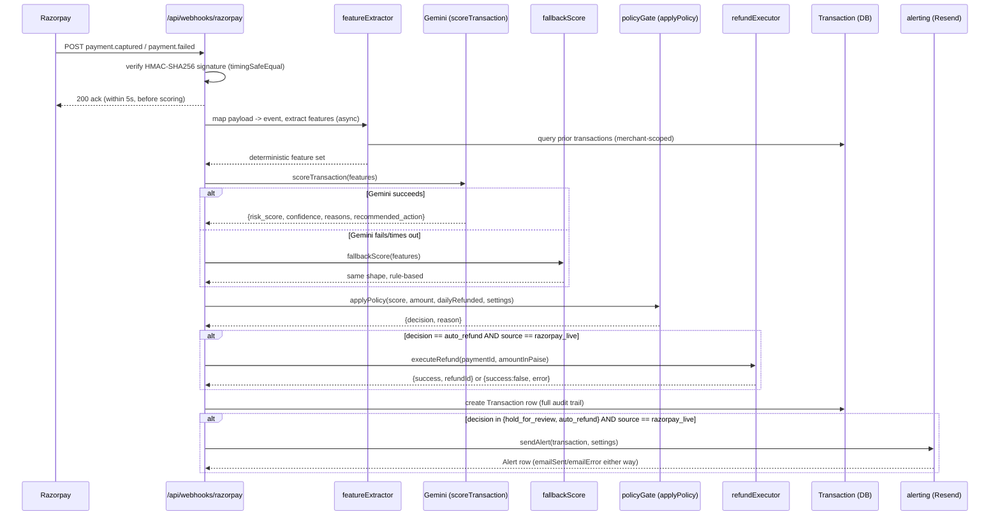

# Sentinel — Project Review

Prepared for an outside reviewer. Verified against the actual repository state (code, schema, `git log`, and a live `/api/metrics` query) rather than written from memory of how it was built.

---

## 1. What this is

Sentinel is a fraud/chargeback risk guard for Razorpay merchants. It sits between a merchant's Razorpay account and their payment operations: every captured or failed payment is scored for fraud risk by Gemini (with a deterministic rule-based fallback when Gemini is unavailable), the score is passed through a hard-coded policy gate that decides `allow` / `hold_for_review` / `auto_refund`, and — critically — the LLM never gets to move money on its own. Only the policy gate can trigger a real refund via Razorpay's API, and only within merchant-configured bounds (max refund amount, daily budget, minimum risk/confidence thresholds). Merchants get a self-serve signup, a dashboard with a full audit trail, configurable policy settings, email alerts on flagged transactions, and a small versioned read-only API for their own integrations. It's built as a single-tenant-per-account multi-tenant app (real signup, real sessions, real per-merchant data isolation) but only one merchant's real Razorpay credentials are wired up at the infrastructure level — see §6.

---

## 2. Architecture overview

Full path from a real Razorpay event to a stored, alerted decision:

Key structural point: **the LLM is a pure advisor.** `scoreTransaction()` / `fallbackScore()` return a `recommended_action`, but only `applyPolicy()` (plain deterministic JS, no LLM call, no DB access — see `lib/policyGate.js`) decides what actually happens, and only `executeRefund()` moves real money, gated separately on `source === "razorpay_live"`.

Two runtime-shape details worth knowing:
- The webhook responds to Razorpay **before** scoring finishes (fire-and-forget `.then()/.catch()`), because Razorpay's 5-second webhook timeout is tighter than Gemini's observed 3-6s response time. The audit row lands a few seconds after the ack.
- `source` (`razorpay_live` / `synthetic` / `demo_simulated`) is the single field that gates every money-moving and merchant-facing side effect (refund execution, the daily refund budget aggregate, and alert firing all check `source === "razorpay_live"` independently in `lib/ingestTransaction.js`). This is discussed further in §9.

---

## 3. Every major feature

### Deterministic feature extraction
`lib/featureExtractor.js`. Computes `disposableEmail`, `countryMismatch`, `velocityLast10Min`, `amountVsHistoryRatio`, `isNewCustomer`, `previousChargebacks`, `oddHour` from the event plus a merchant-scoped query of prior transactions. Pure and deterministic — no LLM involvement — so the same input always produces the same feature set, which both scorers then interpret.

### Gemini-based explainable risk scoring
`lib/gemini.js`. Calls `gemini-3.5-flash-lite` with a structured JSON schema (`risk_score`, `confidence`, `reasons[]`, `recommended_action`), an 8s timeout, and a prompt that explicitly requires reasons to cite actual signal values rather than generic statements. Throws (rather than returning a degraded result) on timeout, API failure, or schema-validation failure, so the caller can cleanly fall back.

### Rule-based fallback
`lib/fallbackHeuristic.js`. Fixed additive weights per signal (disposable email +0.35, country mismatch +0.25, velocity>2 +0.25, chargebacks>0 +0.3, odd hour +0.1, amount ratio>3 +0.2), capped at 1.0, fixed confidence 0.5. **Its `recommended_action` can only ever be `"allow"` or `"hold_for_review"` — never `"auto_refund"`** (see the ternary at the bottom of the file). This is a real, load-bearing asymmetry: a real auto-refund can only happen when Gemini is actually live and responding, never from the fallback path. It fires whenever `scoreTransaction()` throws (real API failure) or when `forceFallback: true` is explicitly passed (the dashboard's outage-simulation demo — never set on any real request path).

### The policy gate
`lib/policyGate.js`. Pure function, no DB access, no LLM calls. Current default bounds (now merchant-configurable, see below — these were the original hard-coded values and remain the schema defaults):
- `autoRefundMaxAmount`: ₹2,000
- `dailyRefundCap`: ₹10,000
- `autoRefundMinRiskScore`: > 0.9
- `autoRefundMinConfidence`: > 0.8
- `holdForReviewMinRiskScore`: > 0.6

Auto-refund requires clearing *all* of: `recommended_action === "auto_refund"`, amount within cap, risk > 0.9, confidence > 0.8, and daily budget not exceeded. Any one failing downgrades to `hold_for_review` (if still above the hold threshold) with a specific reason string recorded either way. This exists as hand-written JS specifically so the bounds are auditable, testable, and impossible for an LLM to reason its way around — the AI can recommend, it cannot approve.

### Real Razorpay webhook integration
`app/api/webhooks/razorpay/route.js`. HMAC-SHA256 signature verification using `crypto.timingSafeEqual` (constant-time, avoids timing side-channels) against `RAZORPAY_WEBHOOK_SECRET`. Handles `payment.captured`, `payment.failed`, `payment.dispute.created` (marks a `disputedAt` timestamp on the matching transaction for future `previousChargebacks` signals), and no-ops everything else with a 200.

### Real refund execution
`lib/refundExecutor.js`, wired into `lib/ingestTransaction.js`. Calls Razorpay's real `payments.refund()` API. Never throws — always returns `{success, refundId}` or `{success:false, error}` — so a failed refund call still results in a saved, honest audit row (`refundExecuted: false`, `refundError: <reason>`) rather than crashing the pipeline. Gated on **both** `policyDecision === "auto_refund"` and `source === "razorpay_live"` — verified in this review by reading `lib/ingestTransaction.js` lines 107-115.

### Multi-merchant data model and isolation
`prisma/schema.prisma`, `middleware.js`, `lib/currentMerchant.js`, `lib/session.js`. Every `Transaction`, `Alert`, and `MerchantSettings` row carries a `merchantId` foreign key. Every query site across the app (dashboard APIs, the demo routes, feature extraction's history lookup) filters by the logged-in merchant's id, resolved from a signed session cookie. See §6 for the one deliberate exception (the webhook).

### Configurable per-merchant policy settings
`app/api/settings/route.js`, `lib/merchantSettings.js`, `/settings` page. Each merchant has one `MerchantSettings` row (created via `upsert` on first access, or explicitly at signup) holding their own refund caps, thresholds, and alert email. Validated server-side (`dailyRefundCap >= autoRefundMaxAmount`, non-negative amounts, 0-1 range on score/confidence fields).

### Real email alerting
`lib/alerting.js`, using Resend. Fires for any `hold_for_review`/`auto_refund` decision on a `razorpay_live` transaction, sent to `settings.alertEmail` or the merchant's signup email as fallback. Wrapped so a broken email provider (bad key, rate limit, rejected recipient) can never break ingestion — every outcome is recorded on the `Alert` row (`emailSent`, `emailError`), and the underlying `Transaction` is always saved first, independent of email outcome. See §9 for a real bug found and fixed here during development.

### The external versioned API
`app/api/v1/transactions/route.js`. `Authorization: Bearer <apiKey>` auth against `MerchantSettings.apiKey` (a `sk_live_`-prefixed random 48-hex-char token, regenerable from `/settings`). Read-only, GET-only. `source` query param defaults to `razorpay_live` (a merchant querying "their" data shouldn't see synthetic/demo rows unless they ask), `decision` filters by `policyDecision`, `limit` caps at 100. Returns a stable, deliberately narrow external shape (`transactionId, amount, riskScore, confidence, policyDecision, actionTaken, reasons, refundExecuted, refundId, timestamp`) — not a raw Prisma row dump. In-memory per-key token bucket rate limiting (20 capacity, 2/sec refill) in `lib/rateLimiter.js`.

### The three on-demand demo scenarios
`app/api/demo/simulate-outage/route.js`, surfaced on `/dashboard`. All three set `source: "demo_simulated"` and `forceFallback: true` (Gemini is never actually called), so they're structurally incapable of touching the real refund/alert/daily-budget code paths (those all gate on `source === "razorpay_live"`):
- **Clean**: deterministic risk-0 fallback score, demonstrates the `allow` path.
- **Suspicious**: multiple stacked fallback signals, demonstrates `hold_for_review` reached via the *real* rule-based scorer (not a forced score).
- **Auto-refund (forced)**: the one place a specific score is injected directly (`forcedScoringOutput`), since the fallback heuristic can never itself recommend `auto_refund` — this is the only way to demo that decision path without a live, cooperative Gemini call.

### The audit trail / dashboard
`app/dashboard/page.js` + `components/dashboard/DashboardContent.jsx`. Policy Bounds panel (live from `MerchantSettings`, with a today's-budget-used gauge scoped to `razorpay_live` only), held-out test metrics panel, the outage demo, a recent-transactions feed, an Alerts list, and a filterable/paginated full audit trail.

---

## 4. Data model

Four models, all SQLite via Prisma (`prisma/schema.prisma`):

**`Merchant`** — one row per signed-up account. `id` (cuid), `name`, `email` (unique), `password` (bcrypt hash), `createdAt`. Has one `MerchantSettings`, many `Transaction`, many `Alert`.

**`Transaction`** — the audit-trail row, one per scored payment event, regardless of source. Belongs to a `Merchant`. Core payment fields (`txnId` — unique, doubles as the real Razorpay payment ID for `razorpay_live` rows; `amount`, `email`, `ipCountry`, `billingCountry`, `timestamp`). Scoring output (`features` JSON, `riskScore`, `confidence`, `reasons` JSON array, `usedFallback`). Decision (`policyDecision`, `actionTaken` — currently always equal, `humanOverride` — present in schema but not yet wired to any UI). Provenance (`source`: `synthetic` | `demo_simulated` | `razorpay_live`; `isLabeledFraud` — nullable, only set on synthetic seed data, used for metrics). Refund outcome (`refundExecuted`, `refundId`, `refundError`). Dispute tracking (`disputedAt`). Has many `Alert`.

**`Alert`** — one row per alert fired. Belongs to both a `Merchant` and a `Transaction`. `sentTo`, `subject`, `body` (plaintext, used for both the email body and DB record), `emailSent`, `emailError`.

**`MerchantSettings`** — one row per merchant (enforced via `merchantId @unique`), created lazily via `upsert`. The five policy bounds (all with schema defaults matching the original hard-coded values), `alertEmail` (nullable — falls back to the merchant's signup email), `apiKey` (nullable in the schema — see §6 for why).

Notably *not* modeled yet: no `Refund` entity separate from the flags on `Transaction`; no `AuditLog` for settings/API-key changes; no `Session` table (sessions are stateless JWTs, not DB-backed, so there's no way to list/revoke active sessions from the server side).

---

## 5. Metrics

Two real seed runs exist, both against the same 400-row synthetic labeled dataset (`data/syntheticTransactions.json`), through the real pipeline (Gemini + fallback + policy gate, no mocking).

| | Run 1 | Run 2 (verified live via `/api/metrics` during this review) |
|---|---|---|
| Fallback rate | 69.25% | 78.75% |
| Precision | 1.00 | 1.00 |
| Recall | 0.38 | 0.18 |
| F1 | 0.55 | 0.305 |
| TP / FP / FN / TN | not re-verifiable (overwritten) | 18 / 0 / 82 / 300 |

**Note on Run 1**: those numbers come from an earlier point in this project's history that predates the current database state — the underlying rows were overwritten by Run 2's reseed, so I could not independently re-verify Run 1 against the DB; I've reported it as given. Run 2 I queried directly against the live `/api/metrics` endpoint during this review and it matches exactly: `{"totalLabeled":400,"truePositives":18,"falsePositives":0,"falseNegatives":82,"trueNegatives":300,"precision":1,"recall":0.18,"f1":0.305...,"fallbackRate":0.7875}`.

**Why recall tracks fallback rate, honestly explained**: precision is 1.0 in both runs — neither scorer ever wrongly flags a clean transaction. That's not a coincidence; both are deliberately conservative (the fallback's weights require multiple signals to stack past a 0.7 threshold before it recommends anything beyond `allow`; Gemini's prompt explicitly forbids fabricating a reason for a benign signal). Recall is where they diverge sharply. The fallback heuristic is a fixed-weight linear scorer — it can only catch fraud patterns that happen to stack enough of its six hard-coded signals. Gemini can reason more holistically about combinations the fallback doesn't explicitly encode. So every percentage point of fallback usage is, empirically, a percentage point of the system's sensitivity handed to the more conservative, less contextual scorer. **This means the system's real-world recall is directly hostage to Gemini's uptime/quota** — a fact worth being upfront about rather than treating the fallback rate as a purely cosmetic "resilience" story. It genuinely is graceful degradation (nothing crashes, precision holds), but it is degradation, not a free lunch.

---

## 6. Known limitations / explicit scope boundaries

Verified against the actual code, not asserted from memory:

- **Webhook traffic is tied to one merchant's Razorpay credentials.** `app/api/webhooks/razorpay/route.js` hard-codes `DEFAULT_MERCHANT_ID` for every incoming webhook, with an explicit in-code comment explaining why (no per-merchant Razorpay OAuth/Connect integration yet — every merchant would need their own `RAZORPAY_KEY_ID`/webhook secret stored and matched against). This means the multi-tenant signup/dashboard/settings/API-key system is real, but only one merchant can currently receive real Razorpay traffic in this deployment.
- **Email uses Resend's sandbox sender** (`onboarding@resend.dev`), not a verified custom domain. Confirmed during this build: Resend's API outright rejects sends to `example.com`-domain addresses and (per Resend's own restriction) only reliably delivers to the email the sending account itself signed up with, until a domain is verified.
- **Rate limiting is in-memory, single-process** (`lib/rateLimiter.js`, explicitly commented as such). Resets on every restart, doesn't share state across instances — fine for a single dev-server deployment, not for anything horizontally scaled.
- **No automated test suite.** Confirmed: no `*.test.js`/`*.spec.js` files anywhere in the repo. All verification in this project's history was done via live manual testing against the running dev server (curl, direct DB queries), not repeatable CI-style tests.
- **Session auth is a custom `jose`-based JWT implementation**, not a framework (NextAuth, Clerk, etc.) — a deliberate choice (see §9), but it means there's no session table, no server-side session revocation/listing, no built-in refresh-token rotation, no OAuth/social login, and no password-reset flow (only an authenticated change-password endpoint exists — a merchant who forgets their password has no way back in without direct DB access).
- **SQLite, not a production-grade DB.** Fine for single-instance/demo use; would need a real migration (Postgres, etc.) before any concurrent-write-heavy or multi-instance deployment — SQLite's single-writer model is a real ceiling.
- **API keys are stored in plaintext** in `MerchantSettings.apiKey`, not hashed. Unlike passwords (correctly bcrypt-hashed), a DB compromise would directly expose every merchant's live API key. This is a common but real pattern gap versus e.g. Stripe/GitHub, which store only a hash of the key.
- **`MerchantSettings.apiKey` is nullable at the schema level** even though the application-level invariant (every real row has one, backfilled lazily) makes it effectively always non-null in practice. This is a leftover from an incremental migration (the field was added after the model already had rows) rather than a deliberate design choice — worth tightening if the schema is revisited.
- **`featureExtractor.js` and the webhook's `mapPaymentEvent` both do a full unbounded `findMany` over every one of a merchant's prior transactions on every single ingest call**, then filter in JS (this is explicitly because Prisma's JSON-path filtering isn't reliable on SQLite — a documented workaround, not an oversight). This is an O(n) cost per transaction that will visibly degrade as a merchant's transaction volume grows into the thousands; there's no pagination, time-windowing, or index-assisted narrowing.
- **No webhook idempotency handling beyond the DB's unique constraint on `txnId`.** A redelivered webhook for an already-processed payment would hit a Prisma unique-constraint error inside the fire-and-forget `.catch(console.error)` — logged, not silently corrupting data, but also not gracefully short-circuited as "already processed."
- **No email verification on signup**, and `alertEmail` in `/settings` accepts any syntactically valid address with no ownership check — a logged-in merchant can point alerts at an email they don't own.
- **This entire feature set, past the very first commit, is currently uncommitted.** `git log` shows 7 commits, the last being "Add dashboard: recent feed, filterable audit trail, metrics panel." Everything from real webhook integration onward — refund execution, multi-merchant/auth, Resend — exists only in the working tree (`git status` shows ~14 modified + ~34 untracked paths). This is a genuine, immediate risk independent of code quality: if this working tree were lost, essentially the entire build would be gone. **This should be committed before anything else happens to this repo.**
- **`Transaction.humanOverride` exists in the schema but has no wired-up UI or code path that sets it to `true`** — a placeholder for a "human reviewed and overrode the decision" feature that was never built.

---

## 7. Security considerations

- **Password hashing**: bcrypt, cost factor 10, via the real native `bcrypt` binding (verified working on this machine before being adopted over `bcryptjs`). Standard and sound. Cost factor 10 is a reasonable, unbenchmarked default — not tuned against this specific deployment's hardware.
- **Session handling**: signed JWT (HS256, `jose`) in an httpOnly, `sameSite: "lax"` cookie, `secure` flag conditional on `NODE_ENV === "production"`. Signature verified both at the edge (`middleware.js`, for route redirects) and again at the data layer (`lib/currentMerchant.js`, before any DB lookup). No CSRF token — relying on `SameSite=Lax` plus the absence of any state-changing GET route as the CSRF defense. That's a reasonable modern baseline but not a dedicated defense; worth an explicit decision if this ever needs to satisfy a stricter security review.
- **API key handling**: plaintext at rest (see §6) — the clearest concrete security gap in the current build. Transmitted correctly (`Authorization: Bearer`, not a query param, so it won't land in server access logs by default).
- **Webhook signature verification**: HMAC-SHA256 with `crypto.timingSafeEqual`, correctly avoiding a timing side-channel on the comparison. This part is done right.
- **What would need to change before this touched real (non-test) money**:
  1. Real Razorpay production credentials + live webhook secret (currently test-mode keys in `.env`).
  2. Per-merchant Razorpay OAuth/Connect, replacing the single hard-coded webhook-to-merchant mapping.
  3. Hash API keys at rest (store a hash, compare hashes, same pattern as passwords).
  4. Move rate limiting to a shared store (Redis or equivalent) so it holds across restarts/instances.
  5. Add explicit webhook idempotency handling (check-then-skip on duplicate `txnId`, not rely on a thrown constraint error).
  6. Add monitoring/escalation on refund-execution failures — right now a failed real refund is recorded honestly (`refundExecuted: false`) but nothing pages anyone; for real money, a failed auto-refund needs a human notified, not just logged.
  7. Migrate off SQLite for concurrent-write safety.
  8. Add email verification before an address can be set as an alert recipient.

---

## 8. What a reviewer should specifically look at (20 minutes)

**Files that best demonstrate the core design decisions, in priority order:**
1. `lib/ingestTransaction.js` — the entire pipeline in one place; read this first, everything else is a supporting cast.
2. `lib/policyGate.js` — the actual bounds, and the structural proof that the LLM can't approve money movement on its own.
3. `app/api/webhooks/razorpay/route.js` — real signature verification, plus the honestly-commented single-merchant limitation.
4. `lib/alerting.js` — a small, self-contained example of a real bug (see §9) and its fix, worth reading as a case study rather than just a feature.
5. `prisma/schema.prisma` — the whole data model in ~85 lines; confirms or refutes every claim in §4 and §6 directly.

**Three things worth actively questioning or stress-testing, not just reading:**
1. **Hammer `/api/demo/simulate-outage` (auto_refund scenario) rapidly, then check `/api/policy-bounds`'s daily-budget gauge.** It's explicitly source-gated to never move — worth confirming that gate actually holds under concurrent/rapid-fire requests, not just sequential ones.
2. **Set `alertEmail` in `/settings` to an address you don't own and trigger a real `razorpay_live` hold_for_review.** The system will happily email it — decide for yourself whether that's an acceptable gap for this stage or a blocker.
3. **Load a merchant's transaction count up into the thousands (or reason about it without doing so) and look hard at `featureExtractor.js`'s unbounded `findMany`.** Every single ingest call re-scans the merchant's entire transaction history in application code. This is the most likely real performance cliff in the current design, and it's not hypothetical — it's directly in the hot path of every payment scored.

---

## 9. Build history / notable technical decisions

- **Gemini model churn, discovered empirically, not planned for.** `gemini-2.0-flash` was retired mid-build (surfaced as a real API error, not anticipated); its replacement `gemini-2.5-flash` turned out to cap the free tier at 20 requests/day, which a 400-row seed run blows through in minutes; the eventual choice, `gemini-3.5-flash-lite`, has no such quota wall on the same key. All three transitions are visible in `git log` (`Fix Gemini model name: gemini-2.0-flash was retired`, `Switch Gemini model to gemini-3.5-flash-lite`) and directly explain why the fallback path is exercised as heavily as it is (§5) — the fallback rate isn't purely a "resilience feature," it's partly a real scar from working around free-tier constraints during development.
- **A real SDK silent-failure bug, found and fixed during this build.** Resend's Node SDK does not throw on API errors — it resolves successfully with `{ data, error }`. The first version of `sendAlert()` wrapped the call in `try/catch` and treated a successful `await` as success, which meant a deliberately-invalid API key test still recorded `emailSent: true` in the database — a false-positive audit trail for a feature whose entire purpose is honest failure reporting. Caught by actually inspecting server logs against the DB record rather than trusting the absence of a thrown exception, then fixed to check `result.error` explicitly. Worth reading `lib/alerting.js`'s comment on this directly — it's a good concrete example of why "it didn't throw" and "it worked" are not the same claim for a growing number of modern SDKs.
- **`jose` over NextAuth for session handling.** Deliberate, not default: there's exactly one credential type (email/password against the app's own `Merchant` table) and one session need. A full auth framework's provider/adapter surface wasn't judged to buy anything here, while `jose` runs in both Next's edge middleware and Node API routes (unlike a Node-only JWT library), letting one signing/verification implementation serve both route protection and data-layer identity resolution.
- **The `source` field as the single consistent safety gate.** `source: "razorpay_live"` vs `"synthetic"` vs `"demo_simulated"` is checked independently in three separate places in `lib/ingestTransaction.js` (refund execution, the daily-refund-budget aggregate query, and alert firing) — not one shared helper, three independent checks at each money/notification-adjacent decision point. That's a real design choice worth noting both ways: it means there's no single point of failure if one check were ever removed, but it's also duplicated logic that a future refactor could accidentally desync (e.g. if a fourth money-adjacent feature is added and someone forgets to add the same check).
- **Migration friction under a non-interactive shell.** `prisma migrate dev` requires an interactive TTY to confirm certain schema changes (particularly ones involving new required columns or unique-constraint warnings against non-empty tables) and failed outright multiple times in this development environment. The workaround, used consistently across every schema change past the first: generate the raw SQL via `prisma migrate diff`, hand-correct it where Prisma's own diff didn't account for backfilling a new required column against existing rows (visible directly in several migration files under `prisma/migrations/`), then apply via `prisma migrate deploy`. `dev.db` was backed up before every one of these by-hand migrations.
